# Biomatix popgen sandpit — user manual

This sandpit is a **harness** that turns a contract brief from Biomatix Pty Ltd into a delivered population-genetics consulting report, with built-in critics and citation verification, while keeping each job's files strictly isolated from every other job's. Claude Code is the runtime; this manual tells you how to operate it.

---

## 1. Vocabulary

These terms appear throughout the project files and the rest of this manual. Read this section once, then refer back as needed.

**Harness.** The configured environment around Claude — the project's `CLAUDE.md`, settings, skills, subagents, slash commands, hooks, and memory — that converts an open-ended chat session into a disciplined workflow with rules, gates, and safety boundaries. The sandpit *is* the harness; jobs run inside it.

**Job.** One contract from one client. Each job has its own subdirectory under `jobs/<slug>/` containing the brief, parsed contract, data, references, outputs, and per-job memory. Many jobs may live in the sandpit; only one is *active* at a time.

**Contract brief.** The verbatim text Biomatix received from the client describing the work — client name, species, analytical questions (Q1..Qn), binding facts, deliverables, deadlines. Lives at `jobs/<slug>/brief.md` until parsed into `brief.yaml`.

**Active-job pin.** The single line at `.claude/active_job` that names the slug Claude is currently allowed to write into. Set by `/new-job`, swapped by `/switch-job`. The safety hook reads it on every tool call.

**Skill.** A reusable, model-loaded playbook in `.claude/skills/<name>/SKILL.md`. A skill is a body of instructions Claude reads when its description matches the user's request, plus optional helper scripts. The harness's skills are `popgen-report` (the report-production pipeline) plus the writing and citation toolkit (`clear-writing`, `reference-style-1`, `citation-check`, `claim-check`, `review-draft`).

**Slash command.** A user-invoked entry point at `.claude/commands/<name>.md`. Functionally a skill, but always invoked explicitly by typing `/<name>` and almost always with arguments. The harness exposes three: `/new-job`, `/intake`, `/switch-job`. Skills (`/popgen-report`, `/review-draft`, etc.) can also be invoked the same way, but those are model-routed by description in normal use.

**Agent.** Any LLM run. Includes (a) the *primary* agent in your terminal, which is what you talk to, and (b) any *Agent tool* call the primary agent makes to spawn a sub-conversation in an isolated context.

**Subagent.** A persistent agent definition at `.claude/agents/<name>.md` with a fixed name, description, model, tool allowlist, and system prompt. Lives on disk and is auto-routed to when a request matches its description, or invoked explicitly. The four critics (`critic-coverage`, `critic-substance`, `critic-citations`, `critic-writing`) are subagents.

**Coordinator.** A *role* (not a tool) the primary agent plays while running `/popgen-report`. The coordinator owns the DAG, drafts the document, applies critic feedback, and renders the final Word document.

**Critic.** A subagent whose only job is to challenge the draft and return an audit. Critics never edit the draft; they hand findings to the coordinator who decides what to apply.

**Briefing agent.** An ephemeral Agent-tool call spawned at Step 1 of the popgen pipeline (ecologist, conservationist, geneticist) to produce a written briefing for one section of the report. Briefing agents are not on-disk subagents — they are one-shot.

**Hook.** A shell command that fires on a Claude Code lifecycle event (e.g. before a tool call). The sandpit uses one hook, `guard.ps1`, on `PreToolUse`. Hooks are the harness's hard safety layer; settings/permissions are the soft layer.

**Memory.** Persistent notes the project keeps across sessions. Two scopes: `<root>/memory/` for cross-job lessons, `jobs/<slug>/memory/` for one job's state.

**Sandpit root.** The directory containing this `MANUAL.md` and the `.claude/` folder. The safety hook treats this as the boundary; nothing outside is writable by Claude.

**Prompt-coverage gate.** A mandatory checkpoint at Step 0.1 of the popgen pipeline. The coordinator extracts every Q1..Qn from the brief and pairs it with the deliverable section that will answer it. The user confirms the table before any briefing agent is dispatched. The audit is repeated as the closing pass at Step 3, and is the first thing `critic-coverage` checks.

**`citation-check` vs `claim-check`.** Two distinct audits. `citation-check` confirms each *reference entry* exists and its metadata is correct (author, year, journal, DOI). `claim-check` confirms each *in-text assertion* is actually supported by the cited paper's content. Both run at Step 5 inside the `critic-citations` subagent.

---

## 2. The big picture

```mermaid
flowchart TD
    classDef cmd fill:#dbeafe,stroke:#2563eb,color:#000
    classDef agent fill:#fef3c7,stroke:#d97706,color:#000
    classDef skill fill:#dcfce7,stroke:#16a34a,color:#000
    classDef hook fill:#fee2e2,stroke:#dc2626,color:#000
    classDef artefact fill:#f3f4f6,stroke:#6b7280,color:#000
    classDef gate fill:#ede9fe,stroke:#7c3aed,color:#000

    Start([Contract arrives from client])
    Start --> NJ["/new-job &lt;slug&gt;"]:::cmd
    NJ -->|scaffolds + sets active pin| Files[(jobs/&lt;slug&gt;/<br/>brief.md, brief.yaml,<br/>data/, references/,<br/>outputs/, memory/)]:::artefact
    Files --> Paste[Paste contract text<br/>into brief.md]
    Paste --> IN["/intake brief.md"]:::cmd
    IN -->|extracts Q1..Qn,<br/>binding facts, deadlines| YAML[(brief.yaml)]:::artefact
    YAML --> PR["/popgen-report"]:::skill

    PR --> Coverage{Prompt-coverage table<br/>USER CONFIRMS}:::gate
    Coverage --> Brief[Step 1: Parallel briefings<br/>ecologist · conservationist · geneticist]
    Brief --> Plan[Step 2: Planner then Analyst<br/>R via RStudio HTTP]
    Plan --> Draft[Step 3: Coordinator drafts<br/>report_draft.md]
    Draft --> Critics{Step 4: Critics fan out<br/>parallel}
    Critics --> CC[critic-coverage]:::agent
    Critics --> CS[critic-substance]:::agent
    Critics --> CW[critic-writing]:::agent
    CC --> Pass{All return<br/>no blocking issues?}
    CS --> Pass
    CW --> Pass
    Pass -- no, up to 3 cycles --> Draft
    Pass -- yes --> CIT[Step 5: critic-citations]:::agent
    CIT --> CCheck[citation-check<br/>existence + metadata]:::skill
    CIT --> ClCheck[claim-check<br/>assertion vs source]:::skill
    CCheck --> Fix[Coordinator applies fixes,<br/>resolves paywalled cases]
    ClCheck --> Fix
    Fix --> Render[Step 6: Render Word doc<br/>render_word_report.R<br/>pandoc-crossref + Biomatix cover]
    Render --> DOCX[(report_final.docx<br/>in jobs/&lt;slug&gt;/outputs/)]:::artefact
    DOCX --> Sweep[Sweep in Word]
    Sweep --> Ship[Deliver to client]
    DOCX -. optional .-> ReviewOpt["/review-draft"]:::skill

    Hook[guard.ps1<br/>PreToolUse safety hook]:::hook
    Hook -. inspects every Edit / Write /<br/>NotebookEdit / MultiEdit / Bash .-> NJ
    Hook -. blocks writes outside sandpit<br/>or to non-active jobs .-> PR
```



Read the diagram top-to-bottom. The colour code:

| Colour | Meaning |
|---|---|
| Blue | Slash command you type |
| Green | Skill (model-invoked, plus the writing/citation toolkit) |
| Yellow | Subagent the coordinator delegates to |
| Purple | Mandatory gate — the user must confirm before the next step runs |
| Grey | Artefact written to disk |
| Red | Safety hook (always running, dotted lines = inspects everything) |

---

## 3. Daily workflow — start a new job, deliver a report

Step-by-step. Do not skip steps; the gates exist for reasons.

### 3.1 Receive the contract

A brief arrives by email, PDF, docx, or copy-paste. You will need: client name and address, species, the numbered analytical questions, any binding facts, the data file path (or a promise of one), and the deadline.

### 3.2 Scaffold the job

Pick a slug of the form `<client-short>-<species-short>-<YYYYMMDD>`. Then:

```
/new-job nsw-dpe-bellinger-20260315
```

This:
- creates `jobs/nsw-dpe-bellinger-20260315/` with five subdirectories,
- seeds an empty `brief.md` and a placeholder `brief.yaml`,
- writes the slug to `.claude/active_job` — from this moment, writes to any other job's directory are blocked by the safety hook.

### 3.3 Paste the brief and parse it

Open `jobs/<slug>/brief.md` in any editor and paste the verbatim contract text. Then:

```
/intake jobs/nsw-dpe-bellinger-20260315/brief.md
```

Claude extracts client, species, Q1..Qn, binding facts, and deliverables into `brief.yaml`. **Read what it produced.** If a question is ambiguous or a fact is missing, fix the yaml directly or re-run `/intake`. The yaml is the contract; everything downstream uses it.

### 3.4 Drop the data and any local PDFs

Copy the filtered `.Rdata` / `.rds` genlight to `jobs/<slug>/data/`. If you have PDFs of paywalled cited works, drop them into `jobs/<slug>/references/` named by their citation key (e.g. `smith2023.pdf`); `claim-check` will prefer them over web fetch.

### 3.5 Run the report

```
/popgen-report
```

Claude reads `brief.yaml`, asks for any field you left blank, and produces the **prompt-coverage table** at Step 0.1. **Confirm it before proceeding.** This is the single most important gate in the harness — if a question is missing here, it will be missing from the deliverable.

After confirmation, the coordinator runs the six-step pipeline (briefings → analyst → draft → critics → citations → Word render). The critics may iterate up to three times. Expect the run to take a while; the analyst step is bounded by RStudio's response time, and `claim-check` makes one network call per citation.

### 3.6 Inspect the audits, then ship

Before you send the Word document anywhere, open `jobs/<slug>/outputs/`:

- `coverage_audit.md` — any missing question or contradicted fact?
- `substance_audit.md` — any unsupported recommendation?
- `citations_audit.md` — any "paywalled — manual check needed" rows? (Drop a PDF and re-run `claim-check` for that key, or accept the assertion as unverifiable in the report's caveats.)
- `writing_audit.md` — at most 15 prose rewrites and 20 reference-list deviations.
- `claims_audit.md` — the assertion-vs-source verdicts; quoted supporting passages.

`report_final.docx` is the deliverable. Open it in Word, sweep for any final edits (heading styles, line spacing, manual cleanup), then send the reviewed file.

### 3.7 End the session cleanly

Before you close the terminal, ask Claude to update `jobs/<slug>/memory/MEMORY.md` with what was completed and what remains (per CLAUDE.md §7.4). Next session can resume with "continue the bellinger job".

---

## 4. Switching between jobs

You can have many jobs scaffolded at once, but only one is active for writing. To switch:

```
/switch-job awc-mala-20260420
```

Claude shows the current pin, asks you to confirm, and writes the new slug. Reads of the previous job's files keep working — that's how cross-job learning happens.

If the safety hook blocks a write you did not expect, the most common cause is the wrong active-job pin. Check it:

```powershell
Get-Content .claude/active_job
```

---

## 5. Quick reference

### 5.1 Slash commands

| Command | What it does |
|---|---|
| `/new-job <slug>` | Scaffold `jobs/<slug>/`; set the active pin. |
| `/intake <brief.md>` | Parse a contract brief into `brief.yaml`. |
| `/switch-job <slug>` | Swap the active-job pin to a different existing job. |
| `/popgen-report` | Run the full Biomatix consulting-report pipeline. |
| `/review-draft <draft.md>` | Spawn all four critics on an existing draft; produce a consolidated review without re-analysis. (Don't type `/review` — that triggers Claude Code's built-in PR review skill, not this one.) |

### 5.2 Skills

| Skill | Purpose |
|---|---|
| `popgen-report` | Six-role pipeline producing a Biomatix-house-style consulting report. |
| `review-draft` | Thin orchestrator that fans out to the four critic subagents. |
| `clear-writing` | Prose quality (Strunk + Gastel & Day). |
| `reference-style-1` | CSIRO Harvard reference formatting. |
| `citation-check` | References exist; metadata matches CrossRef / PubMed / Scholar. |
| `claim-check` | Assertion in prose is actually supported by the cited paper. |

### 5.3 Subagents

| Subagent | Reads | Writes (returns) |
|---|---|---|
| `critic-coverage` | draft, `brief.yaml`, `prompt_coverage_table.md` | `coverage_audit.md` |
| `critic-substance` | draft, `playbook.md` Appendix B | `substance_audit.md` |
| `critic-citations` | draft, `.bib`, `references/*.pdf` | `citations_audit.md` (orchestrates `citation-check` + `claim-check`) |
| `critic-writing` | draft | `writing_audit.md` |

All four are **read-only** with respect to the draft. They return their audit as text; the orchestrator (the coordinator, or `/review`) writes it to disk.

### 5.4 Where things live

```
sandpit-root/
├── MANUAL.md                   you are here
├── MEMORY.md                   cross-job memory index
├── memory/                     cross-job memory files
├── setup.r                     RStudio startup snippet
├── jobs/
│   └── <slug>/                 ONE per contract; only one is "active"
│       ├── brief.md            verbatim contract
│       ├── brief.yaml          parsed contract (the harness's source of truth)
│       ├── data/               .Rdata, .rds, raw CSVs
│       ├── references/         optional local PDFs for paywalled cites
│       ├── outputs/            drafts, audits, final Word document — the only writable place during a job
│       └── memory/             per-job session notes
└── .claude/
    ├── CLAUDE.md               project rules (R conventions, RStudio HTTP, safety model)
    ├── active_job              ONE LINE: the active job's slug. Set by /new-job and /switch-job.
    ├── settings.json           shared: hooks, env, web-fetch allowlist, jobs/* permissions
    ├── settings.local.json     personal: .bib edit overrides
    ├── agents/                 four critic subagents
    ├── commands/               three slash commands (intake, new-job, switch-job)
    ├── hooks/
    │   ├── guard.ps1           PreToolUse safety hook
    │   └── smoke-test.ps1      manual test for the hook
    └── skills/                 six skills (popgen-report + writing/citation toolkit)
```

---

## 6. The safety model in two paragraphs

The harness has one hook, `guard.ps1`, that runs before every Edit, Write, NotebookEdit, MultiEdit, and Bash tool call. Two invariants are enforced. First, the target path of any write must resolve under the sandpit root. Paths are canonicalised, so `..` traversal and absolute paths are checked equivalently; any attempt to write outside the sandpit is blocked with a stderr message Claude can see. Second, the target path of any write inside `jobs/<slug>/` must match the slug pinned at `.claude/active_job`; writes to any other job are blocked. If no pin exists, all writes to `jobs/*/` are blocked — there is no "default job". The hook also scans Bash commands for the common write idioms (`>`, `>>`, `tee`, `Out-File`, `Set-Content`, `Add-Content`, `New-Item`, `rm`, `Remove-Item`) and applies the same checks to their targets.

What the hook *cannot* enforce: the RStudio HTTP API at `http://127.0.0.1:8787/` runs R with full filesystem access, and the hook cannot reliably parse R code dispatched over curl. The popgen skills constrain R writes to `jobs/<slug>/outputs/` via `setwd()` and prompt-level discipline, but this is not a hard hook. If you want hard enforcement of the R session as well, add wrappers in your `~/.Rprofile` for `write.*`, `save*`, `saveRDS`, etc., that refuse paths not normalising under the sandpit root. The hook itself is documented inline at `.claude/hooks/guard.ps1`; never weaken or disable a check without an explicit reason recorded somewhere.

---

## 7. Troubleshooting

**"BLOCKED by guard.ps1: ... no active job is pinned."**
You ran a write tool against `jobs/<slug>/...` without setting the pin. Either the job is new (`/new-job` should have set it; if it didn't, run `/switch-job <slug>`) or you cleared the pin. Set it and retry.

**"BLOCKED by guard.ps1: ... active job is 'X'."**
You are working in the wrong job. If intentional, `/switch-job <new-slug>`. If accidental, fix the path or stop.

**"BLOCKED by guard.ps1: ... outside the sandpit root."**
A tool tried to write outside the project. This is policy. If you genuinely need to write outside (rare), do it yourself in another terminal — the hook only governs Claude.

**`citations_audit.md` says "paywalled — manual check needed" for a load-bearing citation.**
Find the paper's PDF (institutional login, library, the author), drop it at `jobs/<slug>/references/<key>.pdf`, then ask Claude to re-run `claim-check` for that one key. Or accept the assertion as unverifiable and add a caveat to the report.

**The coordinator skipped Step 0.1.**
This should not happen — `popgen-report` treats Step 0.1 as a hard gate. If you see a draft appear without you having confirmed the prompt-coverage table, stop the run and check that `outputs/prompt_coverage_table.md` exists and matches `brief.yaml`. Re-run from Step 0 if not.

**`/intake` produced an empty `brief.yaml`.**
The brief was probably a PDF or docx the skill couldn't read directly. Convert to markdown first (`pandoc input.pdf -o brief.md`) and re-run `/intake`.

**`pandoc-crossref` warns about a version mismatch at render time.**
Cosmetic. Documented in CLAUDE.md §10. Ignore.

**The R session is unresponsive.**
The popgen skills assume an RStudio session listening on `http://127.0.0.1:8787/` (the user's setup script in `setup.r` starts it). Check the session is alive with `curl http://127.0.0.1:8787/`.

**Can I run two jobs in parallel in two terminals?**
Not safely. The active-job pin is a single file shared by all sessions in the sandpit; whichever terminal switches it last wins, and the other will start failing writes. Run jobs sequentially, or clone the sandpit per parallel job.

---

## 8. Where to read more

- [`.claude/CLAUDE.md`](.claude/CLAUDE.md) — full project rules (R conventions, RStudio HTTP API, memory protocol, safety model).
- [`.claude/skills/popgen-report/SKILL.md`](.claude/skills/popgen-report/SKILL.md) — the consulting-report pipeline in detail.
- [`.claude/skills/popgen-report/playbook.md`](.claude/skills/popgen-report/playbook.md) — the dartRverse analyst playbook used by the report pipeline.
- [`.claude/skills/claim-check/SKILL.md`](.claude/skills/claim-check/SKILL.md) — assertion-vs-source workflow and verdict semantics.
- [`.claude/hooks/guard.ps1`](.claude/hooks/guard.ps1) — the safety hook, with rules and patterns inline.
